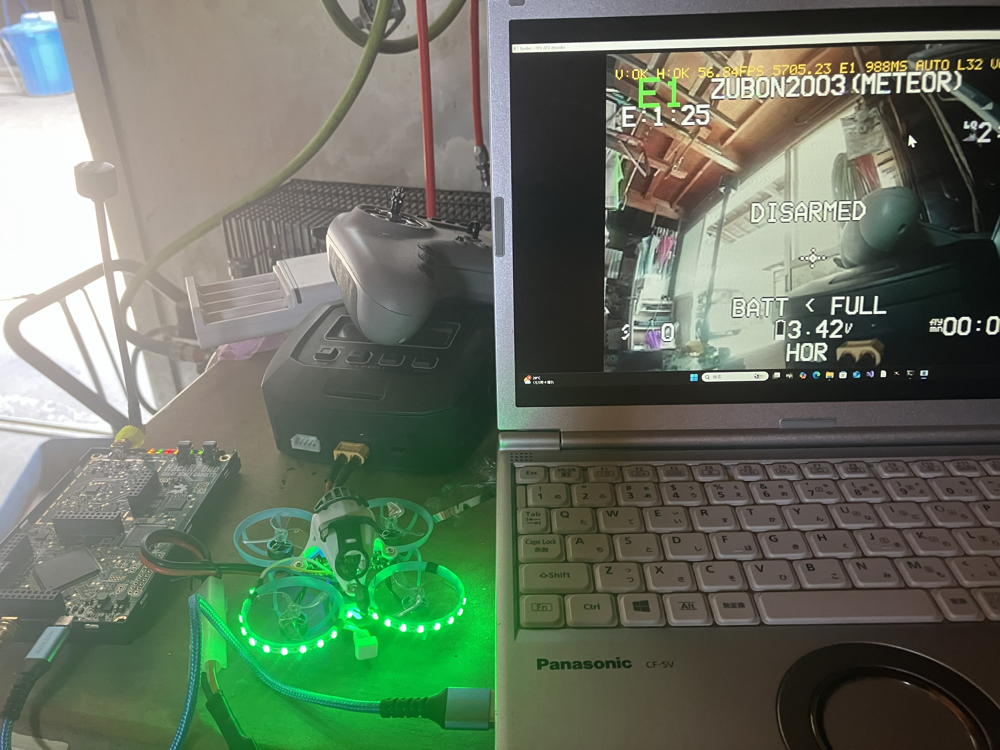

# 5G8atv-rf-hackrf-decoder (fpvdec)

[English README is here](README.md)

HackRF One で **5.8GHz帯アナログFPV映像(FM-ATV、NTSC)** を受信し、PC上で
リアルタイムにカラーデコードするソフトウェア受信機です。C++20 +
libhackrf + SDL2。GNU Radio 不要。

[GOROman/famicom-rf-hackrf-decoder](https://github.com/GOROman/famicom-rf-hackrf-decoder)
(ファミコンVHF RFデコーダ)からのフォークで、NTSCデコーダ部を継承し、
RFフロントエンドを FM-ATV 用に作り直したものです。

デモ動画(クリックで YouTube 再生):

[](https://www.youtube.com/watch?v=dDNk-uRtcGw)

実機 25mW Whoop VTX のライブデコード — 左が HackRF One、ノートPC 上で
fpvdec が動作中(Betaflight OSD が見えます):



## 対応チャンネル

標準的な 5.8GHz アナログFPV 40チャンネル全部に対応。バンド文字+番号で
指定します(例: `--channel F4`):

| バンド | 1 | 2 | 3 | 4 | 5 | 6 | 7 | 8 |
|---|---|---|---|---|---|---|---|---|
| **A** (Boscam) | 5865 | 5845 | 5825 | 5805 | 5785 | 5765 | 5745 | 5725 |
| **B** (Boscam) | 5733 | 5752 | 5771 | 5790 | 5809 | 5828 | 5847 | 5866 |
| **E** | 5705 | 5685 | 5665 | 5645 | 5885 | 5905 | 5925 | 5945 |
| **F** (Airwave) | 5740 | 5760 | 5780 | 5800 | 5820 | 5840 | 5860 | 5880 |
| **R** (レースバンド) | 5658 | 5695 | 5732 | 5769 | 5806 | 5843 | 5880 | 5917 |

2段構えの **AFC** が VTX を自動追尾します:粗調整段が電源投入直後に
2〜3MHz ずれた VTX を引き込み、精密段がウォームアップ中のドリフト
(実機で最初の数分に約1MHz)に追従し続けます。

## ハードウェア

[HackRF One](https://greatscottgadgets.com/hackrf/one/) を受信専用・
10MSPS で使用します。付属ホイップアンテナは机上距離なら動作しますが、
距離を出すには **5.8GHz 円偏波パッチ/ヘリカルアンテナ**を推奨します
(FPV VTX は円偏波のため、直線偏波ホイップは常時 -3dB + 深いマルチパス
フェードを受けます)。+14dB RF アンプはデフォルト ON です
(`--no-amp` で無効)。

## ビルド

### Windows (MSVC)

Visual Studio 2022、CMake、[PothosSDR](https://downloads.myriadrf.org/builds/PothosSDR/)
(libhackrf 用)、および SDL2 の VC 開発パッケージを `third_party/SDL2`
に展開(ヘッダを `include/SDL2/` にもコピー)しておきます。

```sh
cmake -B build -G "Visual Studio 17 2022" -A x64
cmake --build build --config Release
```

`SDL2.dll` / `hackrf.dll` は自動で exe の隣にコピーされます。

### macOS / Linux

```sh
brew install hackrf sdl2 cmake pkg-config   # apt でも同等
cmake -B build -DCMAKE_BUILD_TYPE=Release
cmake --build build -j
```

## 使い方

```sh
# ライブ受信: チャンネルプリセット指定(あとは AFC と自動ゲインにお任せ)
./build/Release/fpvdec --channel F4

# 周波数直接指定 / 変調極性が逆の VTX
./build/Release/fpvdec --freq 5806e6 --invert

# デコードしながら生IQを録画、後でリプレイ
./build/Release/fpvdec --channel R1 --record cap.cs8
./build/Release/fpvdec --input file --file cap.cs8 --loop

# ヘッドレス: デコードフレームを PPM で出力(デバッグ/検証)
./build/Release/fpvdec --input file --file cap.cs8 --dump-frames out_ --frames 30
```

### オプション

| オプション | 説明 |
|---|---|
| `--channel NAME` | FPVチャンネル、バンド A/B/E/F/R + 1-8(デフォルト F4) |
| `--freq HZ` | 搬送波周波数の直接指定 |
| `--dev HZ` | FM ピーク偏移(デフォルト 5e6) |
| `--invert` | ディスクリミネータ極性反転(非標準 VTX 用) |
| `--no-afc` | 自動周波数追尾を無効化 |
| `--gain auto\|manual` | RFゲイン制御(デフォルト auto) |
| `--lna N` / `--vga N` | ゲイン固定(指定すると manual 扱い) |
| `--no-amp` | +14dB RF プリアンプを無効化(デフォルト ON) |
| `--rate HZ` | サンプルレート(デフォルト 10e6。8e6 で粗い色、7e6 以下はモノクロ、下限目安 6e6) |
| `--lpf HZ` | 検波後映像 LPF(任意、例 4.2e6) |
| `--mode color\|gray` | カラー/モノクロ(デフォルト color) |
| `--sat F` / `--hue DEG` | 彩度/色相トリム |
| `--overscan F` | 左右クロップ(デフォルト 0 — FPV の OSD は画面端にあるため) |
| `--record PATH` | デコードしながら生IQ を .cs8 に保存 |
| `--dump-frames PREFIX` / `--frames N` | ヘッドレス PPM フレーム出力 |
| `--dump-composite PATH` | AGC 後の composite を f32 で出力(デバッグ) |
| `--spectrum` | PSD を表示して終了 |

### キー操作 / OSD

- `q`/ESC 終了、`a` ゲイン auto/manual、`l`/`L` LNA、`g`/`G` VGA、
  `b` RFアンプ、`c` カラー/モノクロ、`o` OSD 表示切替、`s` スクリーンショット、`h` ヘルプ
- `←`/`→` ±50kHz、`↑`/`↓` ±1MHz チューニング、`r` CRT エミュレーション、
  `v` IQ 録画開始/停止(10MSPS ≈ 20MB/s なので短めに)
- **左上(緑の大文字)**: 最寄りの FPV チャンネル名(`F4`)
- **上端1行(黄)**: `V:OK H:OK 59.94FPS 5800.39 F4 45MS AUTO L40 V20 AMP`
  — 同期ロック、フィールドレート、AFC 追尾中の VTX 実周波数、遅延、
  ゲイン状態。ADC クリップ時は赤い `CLIP` を表示

## 動作原理

```
HackRF One (10 MSPS、チャンネルに同調; AFC が VTX 中心へ再同調)
  → 複素 DC ブロッカ
  → 4.9 MHz 複素チャンネル LPF(クロマ上側波帯までフラット)
  → FM 直交ディスクリミネータ(AVX2; シンクチップが正になる極性)
  → AGC(ライン毎のシンクチップ/バックポーチ追跡 = ペデスタルクランプ)
  → 専用 1 MHz LPF ストリームで同期分離(約7dBのノイズマージン)
  → フライホイール ライン PLL + インターレース対応の半ライン再アンカー
  → 3.58 MHz クロマ BPF、ライン毎バースト測定、U/V 復調
  → YUV→RGB 640×480(フィールド線二重化、約59.94回/秒更新)
  → トリプルバッファ → SDL2 表示
```

ファミコン版からの主な変更点:AM 検波→FM 検波、2段 AFC(平均周波数に
よる捕捉+占有帯域中点による追尾、リチューン時は AGC へレベル変化を
フィードフォワード)、ADC ピーク統計による RF 自動ゲイン、弱信号向けの
狭帯域同期パス、実カメラのインターレース対応。DSP のホットパス
(FIR、ディスクリミネータ、atan2)は AVX2 ベクトル化済みで、
i7-9700K・10MSPS で実時間の約2.4倍で動作します。

## テスト

```sh
./build/Release/synth_fm            # FM カラーバー合成 → デコード → RGB 検証
./build/Release/synth_fm bars.cs8   # 合成 IQ を .cs8 に書き出し(E2E 用)
ctest --test-dir build -C Release
```

## トラブルシューティング

| 症状 | 対処 |
|---|---|
| スノーのまま同期しない | VTX チャンネルを確認。コンソールの `AFC (coarse)` の引き込みを待つ。`--spectrum` で確認 |
| 白黒反転したような映像 | 非標準極性の VTX → `--invert` |
| 距離でノイズだらけ | 円偏波 5.8GHz アンテナに交換。RF アンプは ON のまま |
| 至近距離で歪む | 自動ゲインが下げるが、それでもだめなら `b` でアンプ OFF |
| 色が出ない | バースト検出に足りない弱信号、または `--rate` が 8MSPS 未満 |
| 遅延表示が増え続ける | CPU が追いついていない → `--rate 8e6` / `6e6` に下げる |

## ライセンス / 免責

MIT License — [LICENSE](LICENSE) を参照。GOROman 氏の
[famicom-rf-hackrf-decoder](https://github.com/GOROman/famicom-rf-hackrf-decoder)
(MIT)がベースです。

受信専用ツールであり、HackRF One から送信は一切行いません。FPV 映像の
受信・運用には国によってアマチュア無線免許や無線局登録が必要です
(日本では必要です)。法令に従って運用してください。
